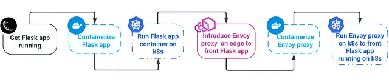

# Introduction

- This package provides a skeleton distribued system impleement edge proxy service to service to reslove provlem:
  - Move logic network out out service suchas: retry, circuit breaker, load balance, etc.
  - Provide a unified way to manage network logic, such as: configuration, monitoring, etc
  - Security tls for each request call

# System requirements:

- minicube is a denmo environment.

# Srouce

- https://medium.com/@viggnah/how-to-deploy-envoy-as-an-edge-proxy-on-kubernetes-f1af78e1ebfb

# High level design:


<!--  -->

Short desc: Flask app run in side a container, container be managed by kubernetes, and expose a service to outside world, it call the other Flask app to get data. through envoy proxy.

# Implementation steps:

1. python3 -m venv .venv, source .venv/bin/activate, cd flask-app, pip install -r requirements.txt
2. runs park app
   flask --app sportshome.py --debug run --host=0.0.0.0 --port=5000

# Install minikube

curl -LO https://github.com/kubernetes/minikube/releases/latest/download/minikube-linux-amd64
sudo install minikube-linux-amd64 /usr/local/bin/minikube && rm minikube-linux-amd64

```bash

docker build -t livescores:latest ./flask-app/
minikube image load livescores:latest
kubectl rollout restart deployment livescores-deployment


minikube start
minikube image load livescores
minikube image ls

kubectl apply -f k8s/deployment-svc.yaml
kubectl get deployment
kubectl get svc
kubectl logs -l app=edge_proxy_app --all-containers

http://10.98.253.109:4200/
```

# Port Mapping

| Resource     | app-a                | app-b                | app-c                |
| ------------ | -------------------- | -------------------- | -------------------- |
| ConfigMap    | `envoy-config-app-a` | `envoy-config-app-b` | `envoy-config-app-c` |
| Admin port   | `9901`               | `9902`               | `9903`               |
| Flask port   | `9001`               | `9002`               | `9003`               |
| Service port | `9101`               | `9102`               | `9103`               |
| LB port      | `9210`               | `9220`               | `9230`               |
| Image        | `edge_proxy_app-a`   | `edge_proxy_app-b`   | `edge_proxy_app-c`   |

# Install enoy local sever

```bash
 docker build -f Dockerfile -t envoyrproxy .
```
