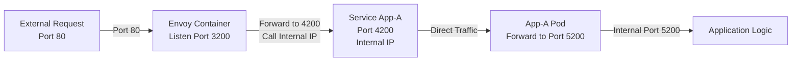

# Router Chain
## Request Flow Diagram

## Detailed Breakdown

1. **External Request (Port 80)**
   - Client sends request to port 80

2. **Envoy Container (Port 3200)**
   - Envoy listens on port 3200
   - Configured to forward traffic to port 4200 using internal IP

3. **Service App-A (Port 4200)**
   - Kubernetes service listening on port 4200
   - Routes traffic to App-A pods

4. **App-A Pod (Port 5200)**
   - Application receives traffic and processes it on internal port 5200
